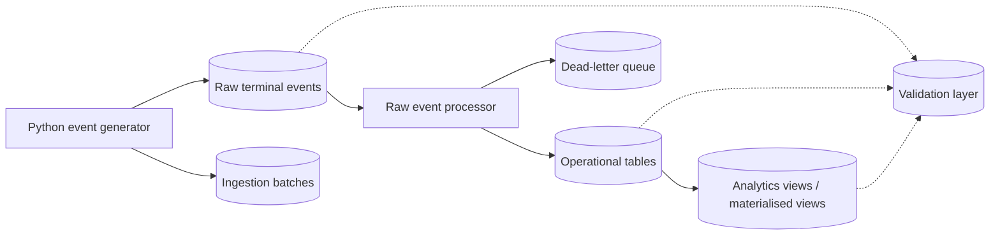

# Shipping Terminal

<p align="left">
  
  
</p>

Academic SQL and Python project modelling container terminal operations in local PostgreSQL with synthetic events, trigger-based integrity checks and analytical views for yard and berth activity.

Built to demonstrate relational modelling, event processing and SQL analysis in a local, inspectable setup.

## Why it matters

This project demonstrates:

- relational modelling of ships, berths, containers and yard locations
- SQL constraints and triggers for operational rules
- synthetic event generation and raw-to-operational processing
- analytical views for utilisation, dwell time and terminal status

## What it includes

- operational tables for schedules, loads, unloads and transfers
- a raw event simulator covering six months of terminal activity
- a processing step that loads raw events into operational tables
- validation tables and views for quality checks and run history
- analytical views for dwell time, yard occupancy and berth utilisation

## System overview



## Main objects

| Area | Purpose | Core objects |
| --- | --- | --- |
| Operational model | Track terminal entities and movements | `Ships`, `Berths`, `Containers`, `Location`, `Schedule`, `Unload`, `Transfer`, `Load` |
| Raw event flow | Store simulated activity before processing | `Raw_Terminal_Events`, `Ingestion_Batches`, `Dead_Letter_Terminal_Events` |
| Analytics | Summarise status and usage | `Ship_Status`, `Container_Status`, `Location_Status`, `Container_Dwell_Time`, `Yard_Heatmap`, `mv_daily_terminal_kpis`, `mv_berth_utilization` |
| Validation | Persist data-quality checks and run history | `Data_Quality_Dashboard`, `Raw_Container_Lifecycle_Audit`, `Data_Validation_Runs`, `Data_Validation_Results`, `Latest_Data_Validation_Run`, `Latest_Data_Validation_Results` |

## Evidence from a local run

These are real outputs from the local project database.

### Validation

```text
Latest_Data_Validation_Run
run_id | status | total_checks | failed_checks
1      | passed | 11           | 0
```

All 11 validation checks passed, including schedule conflicts, load and unload window violations, dead-letter events and raw lifecycle violations.

### Processing snapshot

```text
Ingestion_Batches
batch_id | status    | schedules | unloads | transfers | loads
1        | completed | 557       | 45007   | 29330     | 45007
```

```text
Raw_Event_Queue_Stats
processing_status | event_count
processed         | 119901
```

### Analytical output

```text
mv_daily_terminal_kpis
activity_day | arrivals | departures | loads | unloads | transfers | total_tracked_movements
2026-03-27   | 0        | 1          | 0     | 0       | 0         | 1
2026-03-26   | 1        | 1          | 0     | 0       | 0         | 2
2026-03-25   | 1        | 2          | 0     | 0       | 0         | 3
2026-03-24   | 2        | 0          | 1     | 4       | 1         | 8
2026-03-23   | 0        | 1          | 1     | 1       | 1         | 4
```

```text
mv_berth_utilization
berth_id | activity_day | berth_utilization_pct
2        | 2026-03-27   | 44.23
2        | 2026-03-26   | 5.77
3        | 2026-03-26   | 35.90
1        | 2026-03-25   | 27.56
3        | 2026-03-25   | 5.77
```

## Quick start

1. Install Python dependencies.

```powershell
pip install -r .\requirements.txt
```

2. Initialise and start the local PostgreSQL instance.

```powershell
powershell -ExecutionPolicy Bypass -File .\scripts\init-local-postgres.ps1
```

3. Load the schema, seed data, triggers and analytics objects.

```powershell
powershell -ExecutionPolicy Bypass -File .\scripts\load-project.ps1
```

4. Run the transactional demo.

```powershell
powershell -ExecutionPolicy Bypass -File .\scripts\run-workload.ps1
```

5. Run the synthetic-event flow and validations.

```powershell
powershell -ExecutionPolicy Bypass -File .\scripts\run-6-month-backfill.ps1
powershell -ExecutionPolicy Bypass -File .\scripts\process-raw-events.ps1 -BatchSize 10000 -RefreshAnalytics
powershell -ExecutionPolicy Bypass -File .\scripts\run-data-validations.ps1
```

## Useful queries

```sql
SELECT * FROM Ship_Status;
SELECT * FROM Container_Status;
SELECT * FROM Location_Status;
SELECT * FROM Data_Quality_Dashboard ORDER BY check_name;
SELECT * FROM Latest_Data_Validation_Run;
SELECT * FROM Latest_Data_Validation_Results ORDER BY severity DESC, check_name;
SELECT * FROM Yard_Heatmap ORDER BY occupancy_pct DESC, bay, row;
SELECT * FROM Container_Dwell_Time ORDER BY dwell_time DESC LIMIT 20;
SELECT * FROM mv_daily_terminal_kpis ORDER BY activity_day;
SELECT * FROM mv_berth_utilization ORDER BY activity_day, berth_id;
```

## Repository layout

| Path | Description |
| --- | --- |
| `project_schema.sql` | core relational model and indexes |
| `project_triggers.sql` | trigger functions and rules |
| `project_data.sql` | seed data |
| `project_queries.sql` | status and consistency views |
| `project_workload.sql` | transactional demo |
| `project_data_engineering.sql` | raw event, analytics and validation objects |
| `scripts/terminal_event_pipeline.py` | event generator and raw-event processor |
| `scripts/run_data_validations.py` | validation runner |
| `docs/` | runbook and supporting notes |
