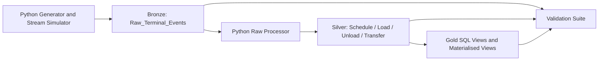

# Local Architecture

## Overview

This project uses a simple layered design:

- Bronze: append-only raw ingestion
- Silver: curated operational tables with trigger-enforced integrity
- Gold: analytics and operational reporting surfaces
- Validation: persisted quality checks and run history

## Layers

### Bronze

- `public.raw_terminal_events`
- `public.ingestion_batches`
- `public.dead_letter_terminal_events`

### Silver

- `public.schedule`
- `public.load`
- `public.unload`
- `public.transfer`
- trigger functions in `project_triggers.sql`

### Gold

- SQL views and materialised views in `project_queries.sql` and `project_data_engineering.sql`
- `Ship_Status`, `Container_Status`, `Location_Status`
- `Container_Dwell_Time`, `Yard_Heatmap`
- `mv_daily_terminal_kpis`, `mv_berth_utilization`

### Validation and Observability

- SQL validation metadata:
  - `public.data_validation_runs`
  - `public.data_validation_results`
  - `public.latest_data_validation_run`
  - `public.latest_data_validation_results`
- SQL quality surfaces:
  - `public.data_quality_dashboard`
  - `public.raw_container_lifecycle_audit`
  - `public.pipeline_freshness`

## Flow

## Why This Layout Works

- The OLTP layer stays explicit and trigger-driven.
- The raw event layer preserves replayability and auditability.
- The gold layer stays in PostgreSQL through views and materialised views, which keeps the project straightforward to explain and rerun.
- The validation layer gives a repeatable check after each run.
